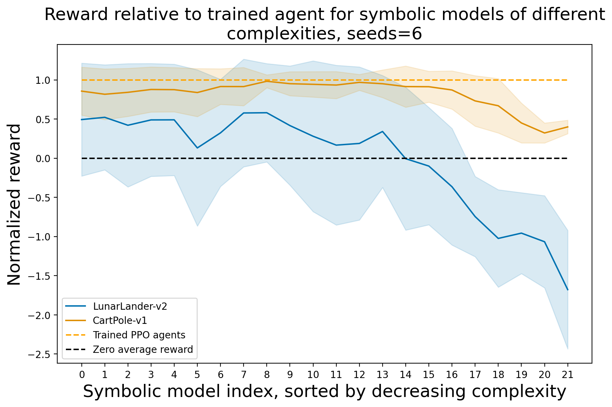

# ATRL Project: Symbolic Policy Extraction in Deep Reinforcement Learning

## Project Overview
This project is part of the lecture **Advanced Topics in Reinforcement Learning (ATRL)** by **Prof. Dr. Marius Lindauer** and **Theresa Eimer** at the **Gottfried Wilhelm Leibniz Universität Hannover (2024)**. The objective is to enhance the interpretability of DRL models by extracting symbolic policies from pre-trained agents, balancing performance with simplicity.

## Abstract
Although Deep Reinforcement Learning (DRL) achieves impressive results, its lack of transparency poses challenges. This project extracts symbolic policies from pre-trained DRL agents, providing simplified representations of decision-making processes. The focus is on two environments: **CartPole-v1** and **LunarLander-v2**, with an emphasis on interpretability without significant performance loss. The experiments have been designed for easy replication using Jupyter notebooks, pre-trained models, and the PySR library.


Figure1. Performance analysis of symbolic models in CartPole-v1 and Lunar Lander-v2 environments using Stable Baselines3, based on 6 seeds. In CartPole, the performance (red function) remains close to the DRL agent's baseline (orange dotted line) across most complexities, but declines at lower complexities. For Lunar Lander, performance starts moderate and decreases with simpler models. The reward variation between environments might partially be due to Lunar Lander allowing negative rewards, unlike CartPole and by being in general more complex with four instead of two actions and a larger observation space.
---

## Repository Contents
- **notebooks/**
  - `ATRL_Example_notebook_CartPole_v1.ipynb`: Used to reproduce experiments for **CartPole-v1**.
  - `ATRL_example_notebook_LunarLander.ipynb`: Used to reproduce experiments for **LunarLander-v2**.
  - `ATRL_Plots_notebook.ipynb`: Generates plots for the analysis in the project report.

## Requirements
The project is designed to run on Google Colab or a local machine with Jupyter Notebooks. Main dependencies:
- Python 3.10
- Stable Baselines3
- PySR for symbolic regression
- Matplotlib for plotting

Dependencies can be installed locally using:

```bash
pip install -r requirements.txt
```

## How to Replicate the Project

1. **CartPole Environment:**
   - Open **`ATRL_Example_notebook_CartPole_v1.ipynb`**, set a seed, and run the notebook. The results will be saved with seed-specific filenames.

2. **LunarLander Environment:**
   - Open **`ATRL_example_notebook_LunarLander.ipynb`**, select a seed, and run the notebook. Results will be saved accordingly.

3. **Generating Plots:**
   - Use **`ATRL_Plots_notebook.ipynb`** to generate figures based on saved experimental results.

## Reproducibility
The project is optimized for Google Colab but can also be run locally. Each notebook includes commands for automatic installation of dependencies to ensure reproducibility. Depending on the configuration, each experiment takes a couple of hours to run for a single seed, so it is recommended to use multiple Google Colab runtimes for experiments involving multiple seeds.

1. **Run in Google Colab:**
   - Open the notebooks in Colab, and dependencies will be installed automatically.

2. **Run Locally:**
   - Clone the repository and install the dependencies:

     ```bash
     git clone https://github.com/ThorKlm/ATRL_project
     pip install -r requirements.txt
     ```

## Key Features
- **Interpretability:** Interpretable symbolic policies are extracted from pre-trained DRL agents.
- **Reproducibility:** The notebooks are designed for easy replication with minimal configuration.
- **Applicability:** The project balances performance with interpretability, making it useful for safety-critical tasks.

## References
- [PySR](https://github.com/MilesCranmer/PySR)
- [Stable Baselines3](https://stable-baselines3.readthedocs.io/en/master/index.html)
- [Huggingface](https://huggingface.co/) pre-trained models: `sb3/ppo-CartPole-v1`, `sb3/ppo-LunarLander-v2`

## Acknowledgments
This project was conducted as part of the **Advanced Topics in Reinforcement Learning** lecture by **Prof. Dr. Marius Lindauer** and **Theresa Eimer** at **Gottfried Wilhelm Leibniz Universität Hannover** (2024).

For more details, visit the [GitHub repository](https://github.com/ThorKlm/ATRL_project).
